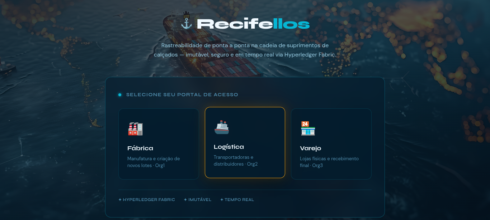

<div align="center">
    
  # Recifellos

  **Enterprise-Grade Supply Chain Traceability on Hyperledger Fabric**

  [](https://www.hyperledger.org/use/fabric)
  [](https://nestjs.com/)
  [](https://astro.build/)
  [](https://reactjs.org/)
</div>

<br />

## 📖 About The Project

<div align="center">
    
</div>

<br />

**Recifellos** is a decentralized supply chain tracking system designed to bring transparency, immutability, and security to the footwear industry. By leveraging blockchain technology, it ensures that every asset transfer—from manufacturing to retail—is cryptographically signed, verified, and permanently recorded on a distributed ledger.

### The Network Structure (Role-Based Access Control)
The ecosystem is governed by a smart contract enforcing strict ownership rules across three distinct organizations:
* 🏭 **Org1 (Factory):** Mints new assets (shoes) and dispatches them.
* 🚚 **Org2 (Logistics):** Assumes custody during transit and ensures secure delivery.
* 🏪 **Org3 (Retail):** Receives the final product, making it available for consumers.

[Image of Hyperledger Fabric supply chain architecture with NestJS gateway and React frontend]

---

## 🛠️ Architecture & Tech Stack

This project is built using a modern, scalable, and secure architecture:

1.  **Smart Contract Layer (Go):** * Chaincode written in Go, deployed on a containerized Hyperledger Fabric network. 
    * Handles strict endorsement policies and state mutations.
2.  **API Gateway Layer (NestJS / TypeScript):** * A modular backend using `@hyperledger/fabric-gateway` via gRPC.
    * Manages cryptographic identities, TLS certificates, and transaction submissions.
3.  **Frontend Presentation Layer (Astro + React):** * Built with Astro's "Islands Architecture" for zero-JS baseline performance.
    * Interactive dashboards powered by **React** and **TanStack Query** for robust state and cache management.
    * Styled with **Tailwind CSS**.
    * *Security Note:* Uses the native browser `fetch` API to mitigate supply chain vulnerabilities from third-party HTTP clients.

---

## 🚀 Getting Started

Follow these instructions to get a local copy up and running.

### Prerequisites
* [Docker](https://www.docker.com/) & Docker Compose
* [Node.js](https://nodejs.org/) (v18+ recommended)
* [Go](https://go.dev/) (for Chaincode compilation)
* Hyperledger Fabric Binaries and Fabric Samples (`test-network`)

### 1. Start the Blockchain Network
Navigate to your Fabric `test-network` directory and bring up the network with the channel and chaincode:
```bash
./network.sh up createChannel -c canal-calcados -ca
./network.sh deployCC -ccn calcados -ccp ../chaincode/rastreabilidade-calcados -ccl go
```

### 2. Start the API Gateway (Backend)
Navigate to the `api` folder, install dependencies, and start the NestJS server:
```bash
cd api
npm install
npm run start:dev
```

### 3. Start the Web Dashboard (Frontend)
Navigate to the `www` folder, install dependencies, and start the Astro development server:
```bash
cd www
npm install
npm run dev
```

---

## 🏗️ Project Structure
```text
.
├── api/          # NestJS Backend (Fabric Gateway)
├── chaincode/    # Smart Contracts (Go)
├── network/      # Hyperledger Fabric Network configuration
└── www/          # Astro + React Frontend
```